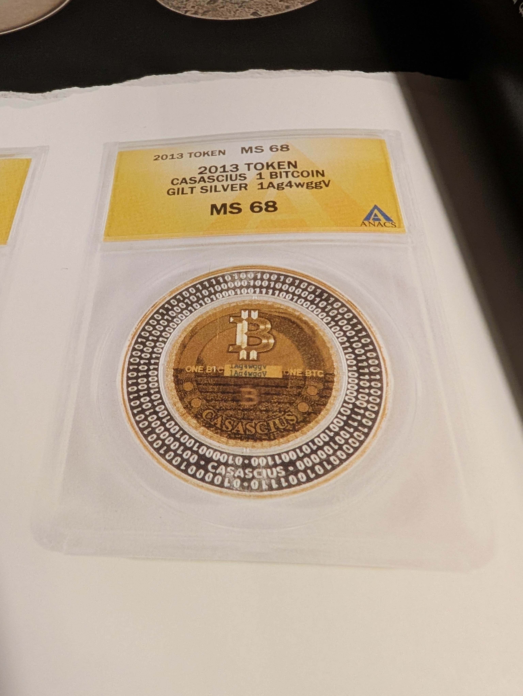

# The Bitcoin (MS68)
_Details on the photo of the Bitcoin on page 223._



### Thoughts
 * 2013 Token, MS68
 * `1Ag4wggV` in center
 * Binary around the outside

### Binary
_starts at bottom_

inner circle
```
00110010100100101000001001100010000001001111001000101010000000100111000101001001001000010
```

2nd circle
```
CASASCIUS 00000100111100101111001000101010000001001000001010100010001000101001001000000100
```

outer circle
```
0111001010000010000001000101110001110010100100101111001011000010001010101001001001000010
```
